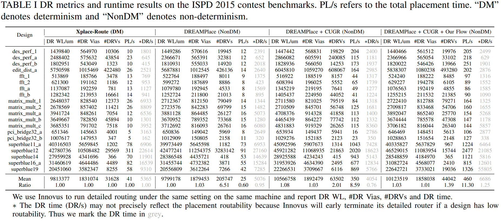
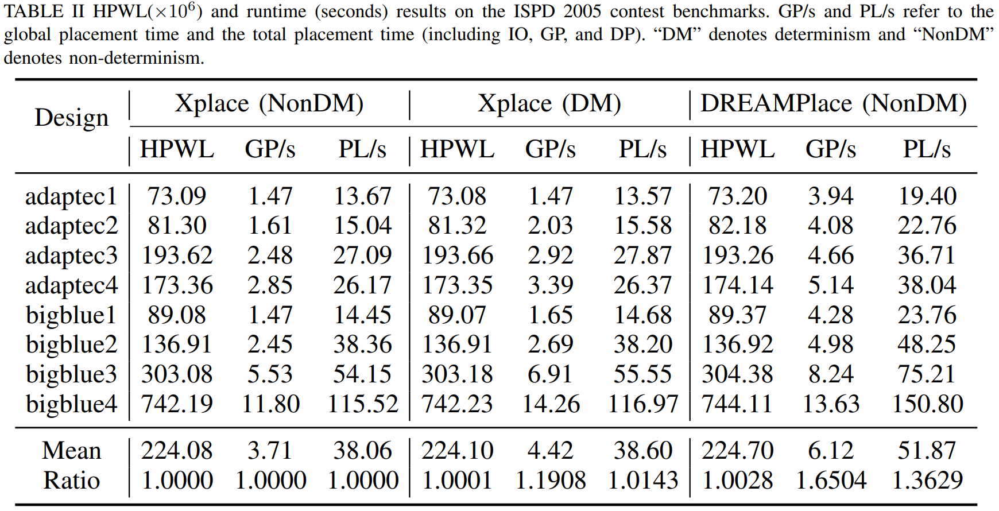
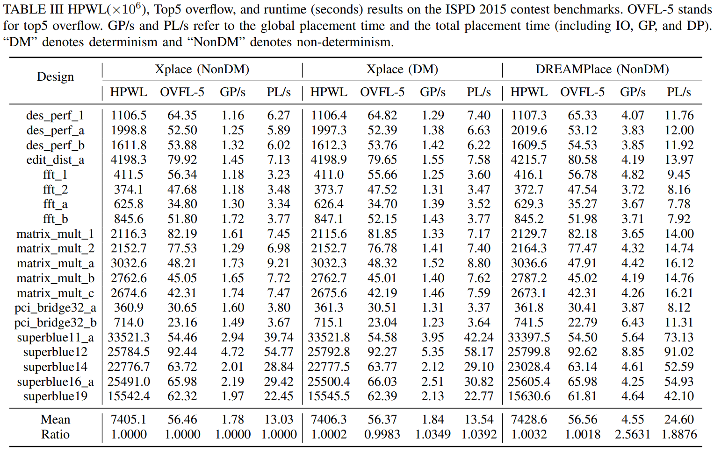

# Experimental Results (Last Updated on May 2023)
## Detailed Routing Performance of Xplace-Route on ISPD 2015
Xplace-Route: Routability GP + DP Flow:
```bash
python main.py --dataset ispd2015_fix --run_all True --load_from_raw True --detail_placement True --use_cell_inflate True
```
and use Innovus® to detailedly route the placement solution. 
<div align="center">
  
</div>

## Performance of Xplace on ISPD 2005
1. Xplace GP + DP Deterministic Flow:
```bash
python main.py --dataset ispd2005 --run_all True --load_from_raw True --detail_placement True
```
2. Xplace GP + DP Non-deterministic Flow:
```bash
python main.py --dataset ispd2005 --run_all True --load_from_raw True --detail_placement True --deterministic False
```
<div align="center">
  
</div>


## Performance of Xplace on ISPD 2015
1. Xplace GP + DP Deterministic Flow:
```bash
python main.py --dataset ispd2015_fix --run_all True --load_from_raw True --detail_placement True
```
2. Xplace GP + DP Non-deterministic Flow:
```bash
python main.py --dataset ispd2015_fix --run_all True --load_from_raw True --detail_placement True --deterministic False
```

<div align="center">
  
</div>
