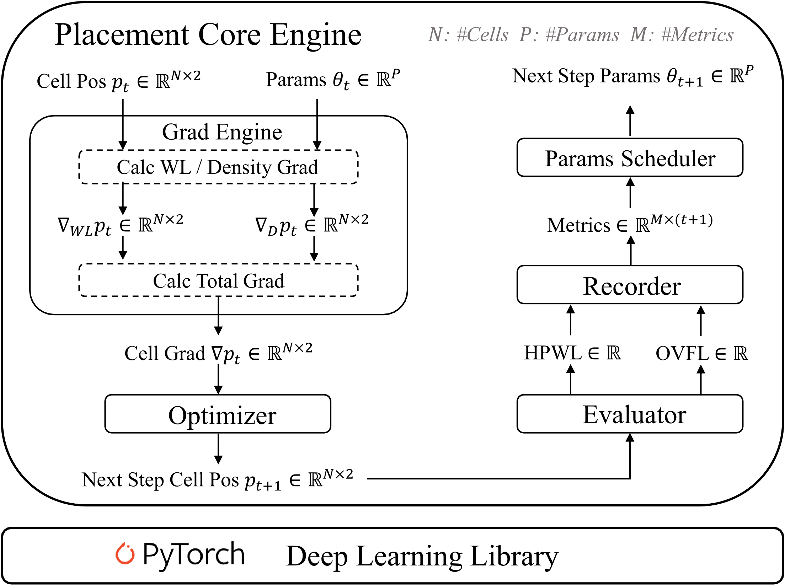

# Xplace: An Extremely Fast and Extensible Global Placement Framework

## News 🚀
We are thrilled to release [Xplace 3.0](https://dl.acm.org/doi/10.1145/3676536.3676803) with timing optimization additional to [Xplace 2.0](https://ieeexplore.ieee.org/abstract/document/10373583) and [Xplace 1.0](https://dl.acm.org/doi/abs/10.1145/3489517.3530485), this version supports the following new features:

- Implement a GPU-accelerated timer.
- Implement an extremely fast GPU-accelerated timing-driven placement algorithm Xplace-Timing.

Please check our [ICCAD paper](https://dl.acm.org/doi/pdf/10.1145/3676536.3676803) for more details about **Xplace-Timing**.

## About Xplace
Xplace is a fast and extensible GPU-accelerated global placement framework developed by the research team supervised by Prof. Evangeline F. Y. Young at The Chinese University of Hong Kong (CUHK). It achieves around 3x speedup per GP iteration compared to DREAMPlace and shows high extensibility.


As shown in the following figure, Xplace framework is built on top of PyTorch and consists of several independent modules. One can easily extend Xplace by applying scheduling techniques, gradient functions, new placement metrics, and so on.

<div align="center">
  
</div>

More details are in the following paper:

Lixin Liu, Bangqi Fu, Martin D. F. Wong, and Evangeline F. Y. Young. "[Xplace: an extremely fast and extensible global placement framework](https://doi.org/10.1145/3489517.3530485)". In Proceedings of the 59th ACM/IEEE Design Automation Conference (DAC '22). Association for Computing Machinery, New York, NY, USA, 1309–1314. 

Lixin Liu, Bangqi Fu, Shiju Lin, Jinwei Liu, Evangeline F.Y. Young, Martin D.F. Wong. "[Xplace: An Extremely Fast and Extensible Placement Framework](https://ieeexplore.ieee.org/document/10373583)". In IEEE Transactions on Computer-Aided Design of Integrated Circuits and Systems (TCAD), doi: 10.1109/TCAD.2023.3346291.

Bangqi Fu, Lixin Liu, Martin D. F. Wong, and Evangeline F. Y. Young. "[Hybrid Modeling and Weighting for Timing-driven Placement with Efficient Calibration](https://dl.acm.org/doi/10.1145/3676536.3676803)". In Proceedings of the 43rd IEEE/ACM International Conference on Computer-Aided Design (ICCAD '24). Association for Computing Machinery, New York, NY, USA, Article 22, 1–9.

(For the Xplace-NN, please refer to branch [neural](https://github.com/cuhk-eda/Xplace/tree/neural))

- [1. How to Build](#1-how-to-build)
  * [1.1. Dependencies](#11-dependencies)
- [2. How to Run](#2-how-to-run)
  * [2.1. Data Preparation](#21-data-preparation)
  * [2.2. Run Placement Flow](#22-run-placement-flow)
  * [2.3. Run Your Own Design](#23-run-your-own-design)
  * [2.4. Placement Parameters](#24-placement-parameters)
- [3. Other Features](#3-other-features)
  * [3.1. Standalone Timer Mode](#31-standalone-timer-mode)
  * [3.2. GPU-accelerated Place and Global Route Flow](#32-gpu-accelerated-place-and-global-route-flow)
  * [3.3. Evaluate the Routability of Placement Solution](#33-evaluate-the-routability-of-placement-solution)
  * [3.4. Load Design from Preprocessed File](#34-load-design-from-preprocessed-file)
- [4. Citation](#4-citation)
- [5. Contact](#5-contact)
- [6. License](#6-license)

## 1. How to Build
**Step 1**: Clone the Xplace repository. We'll call the directory that you cloned Xplace as `$XPLACE_HOME`.
```bash
git clone --recursive https://github.com/cuhk-eda/Xplace
```
**Step 2**: Build the shared libraries used in Xplace.
```bash
cd $XPLACE_HOME
mkdir build && cd build
cmake -DCMAKE_CUDA_ARCHITECTURES=native -DPYTHON_EXECUTABLE=$(which python) ..
make -j40 && make install
```

NOTE: If `-DCMAKE_CUDA_ARCHITECTURES=native` doesn't work on your system, manually specify your GPU's compute capability instead, using`-DCMAKE_CUDA_ARCHITECTURES=your_gpu_compute_capability`.

You can find your GPU's compute capability on NVIDIA's official list: [https://developer.nvidia.com/cuda-gpus](https://developer.nvidia.com/cuda-gpus).

For example, RTX 3090's compute capability is 8.6. You would specify: `-DCMAKE_CUDA_ARCHITECTURES=86`.

### 1.1. Dependencies
- [CMake](https://cmake.org/) >= 3.24
- [GCC](https://gcc.gnu.org/) >= 7.5.0
- [Boost](https://www.boost.org/) >= 1.56.0
- [CUDA](https://developer.nvidia.com/cuda-toolkit) >= 11.3
- [Python](https://www.python.org/) >= 3.8
- [PyTorch](https://pytorch.org/) >= 1.12.0
- [Cairo](https://www.cairographics.org/)
- [Innovus®](https://www.cadence.com/content/cadence-www/global/en_US/home/tools/digital-design-and-signoff/soc-implementation-and-floorplanning/innovus-implementation-system.html) (version 20.14, optional, for detailed routing and design rule checking)

## 2. How to Run
### 2.1. Data Preparation 
The following script will automatically download `ispd2005`, `ispd2015`, `iccad2019`, `ispd2018`, and `ispd2019` benchmarks in `./data/raw`. It also preprocesses `ispd2015` benchmark to fix some errors. Note that Innovus® can run detailed routing on this fixed `ispd2015`.
```bash
cd $XPLACE_HOME/data
./download_data.sh
```

### 2.2. Run Placement Flow
- To run GP + DP flow for ISPD2005 dataset:
```bash
# only run adaptec1
python main.py --dataset ispd2005 --design_name adaptec1

# run all the designs in ispd2005
python main.py --dataset ispd2005 --run_all True
```

- To run GP + DP flow for ISPD2015 dataset:
```bash
# only run mgc_fft_1
python main.py --dataset ispd2015_fix --design_name mgc_fft_1

# run all the designs in ispd2015
python main.py --dataset ispd2015_fix --run_all True
```

- To run timing optimization GP + DP flow for ICCAD2015 dataset:
```bash
# only run superblue4
python main.py --dataset iccad2015 --design_name superblue4 --timing_opt True

# run all the designs in iccad2015
python main.py --dataset iccad2015 --run_all True --timing_opt True
```

- To run Routability GP + DP flow for ISPD2015/2018/2019 dataset:
```bash
# run all the designs with routability optimization
python main.py --dataset ispd2015_fix --run_all True --use_cell_inflate True

python main.py --dataset ispd2018 --run_all True --use_cell_inflate True

python main.py --dataset ispd2019_no_fence --run_all True --use_cell_inflate True
```

- To run Mixed-Size flow for MMS dataset:
```bash
python main.py --dataset mms --run_all True --mixed_size True
```

**NOTE**: We default enable the deterministic mode. If you don't need determinism and want to run placement in an extremely fast mode, please try to set `--deterministic False` in the Python arguments.

- Each run will generate several output files in `./result/exp_id`. These files can provide valuable information for parameter tuning.
```
In ./result/exp_id
   - eval    # parameter curves and the visualization of placement solutions
   - log     # log and statistics
   - output  # placement solutions
```

### 2.3. Run Your Own Design
- **Custom Path Mode**: You can use the argument `--custom_path` to run your custom LEF/DEF or bookshelf benchmark.

Suppose there is a LEF/DEF benchmark named `toy` in `data/raw`, you can use the following command line to run the GP + DP flow:
```bash
python main.py --custom_path lef:data/raw/toy_input.lef,def:data/raw/toy_input.def,design_name:toy,benchmark:test --load_from_raw True --detail_placement True
```

- **Custom JSON Mode**: You can also use the argument `--custom_json` to run multiple LEFs + DEF + Verilog + LIBs:
```
python main.py --custom_json examples/examples.json --load_from_raw True --target_density 0.9
```
Please provide your LEFs/DEF in the input `json` file. An example of [ASAP7](https://github.com/The-OpenROAD-Project/asap7) input is given in `./examples/examples.json`. Note that the `verilog` format is only partially supported.

### 2.4. Placement Parameters
Please refer to `main.py`.

## 3. Other Features

### 3.1. Standalone Timer Mode
Setup the design parameters in `tool/timer.py` and run. Put the extracted parasitics file in `spef` option to report the spef timing. An example is given in the `tool/timer.py` file.
```bash
python tool/timer.py
```

### 3.2. GPU-accelerated Place and Global Route Flow
Set `--final_route_eval True` in Python arguments to invoke the internal global router [GGR](cpp_to_py/gpugr/README.md) to run GPU-accelerated PnR flow. The flow will output the **placement DEF** and the **global routing guide** in `./result/exp_id/output`. Besides, GR metrics are reported in the log and recorded in `./result/exp_id/log/route.csv`. 

- To run Place and Global Route flow for ISPD2015 dataset:
```bash
python main.py --dataset ispd2015_fix --run_all True --load_from_raw True --detail_placement True --use_cell_inflate True --final_route_eval True
```

More details about using GGR in Xplace can be found in [cpp_to_py/gpugr/README.md](cpp_to_py/gpugr/README.md).

### 3.3. Evaluate the Routability of Placement Solution 
We provide three ways to evaluate the routability of a placement solution:

1. Set `--final_route_eval True` to invoke [GGR](cpp_to_py/gpugr/README.md) to evaluate the placement solution.

2. Use [CU-GR](https://github.com/cuhk-eda/cu-gr) to evaluate the placement solution by global routing. Please refer to [tool/cugr_ispd2015_fix/README.md](tool/cugr_ispd2015_fix/README.md) for instructions.

3. (Optional). If Innovus® has been properly installed in your OS, you may try to use Innovus® to detailedly route the placement solution. Please refer to [tool/innovus_ispd2015_fix/README.md](tool/innovus_ispd2015_fix/README.md) for instructions.


### 3.4. Load Design from Preprocessed File
The following script will dump the parsed design into a single torch `pt` file so Xplace can load the design from the `pt` file instead of parsing the input file from scratch. 

```bash
cd $XPLACE_HOME/data
python convert_design_to_torch_data.py --dataset ispd2005
python convert_design_to_torch_data.py --dataset ispd2015_fix
python convert_design_to_torch_data.py --dataset iccad2019
```
Preprocessed data is saved in `./data/cad`.

To develop a new global placement technique in Xplace, we highly suggest using the `pt` mode to save the parser time. (set `--load_from_raw False`)

```bash
python main.py --dataset ispd2005 --run_all True --load_from_raw False
```

**NOTE**: 
1. Please remember to use the raw mode (set `--load_from_raw True`) when measuring the total running time.
2. We currently do not support `pt` mode in the routability-driven global placement.
3. If you want to run `pt` mode for the custom dataset, you need to add the custom dataset path in `utils/get_design_params.py`.

## 4. Citation
If you find **Xplace** useful in your research, please consider to cite:
```bibtex

@inproceedings{fu2024xplace_t,
    author = {Fu, Bangqi and Liu, Lixin and Wong, Martin D. F. and Young, Evangeline F. Y.},
    booktitle = {Proceedings of the 43rd IEEE/ACM International Conference on Computer-Aided Design},
    title = {Hybrid Modeling and Weighting for Timing-driven Placement with Efficient Calibration},
    year = {2024},
}

@article{xplace_tcad,
    author={Liu, Lixin and Fu, Bangqi and Lin, Shiju and Liu, Jinwei and Young, Evangeline F.Y. and Wong, Martin D.F.},
    journal={IEEE Transactions on Computer-Aided Design of Integrated Circuits and Systems}, 
    title={Xplace: An Extremely Fast and Extensible Placement Framework}, 
    year={2023},
}

@inproceedings{liu2022xplace,
    author={Liu, Lixin and Fu, Bangqi and Wong, Martin D. F. and Young, Evangeline F. Y.},
    booktitle={Proceedings of the 59th ACM/IEEE Design Automation Conference},
    title={Xplace: An Extremely Fast and Extensible Global Placement Framework},
    year={2022},
}
```

Thanks the authors of [ePlace](https://dl.acm.org/doi/10.1145/2699873), [RePlAce](https://github.com/The-OpenROAD-Project/RePlAce), [DREAMPlace](https://github.com/limbo018/DREAMPlace), [OpenTimer](https://github.com/OpenTimer/OpenTimer), and [GPU-STA](https://ieeexplore.ieee.org/document/9256516) for their great work.
```bibtex
@article{lu2015eplace,
    author={Lu, Jingwei and Chen, Pengwen and Chang,   Chin-Chih and Sha, Lu and Huang, Dennis Jen-Hsin and   Teng, Chin-Chi and Cheng, Chung-Kuan},
    journal={ACM Trans. Des. Autom. Electron. Syst.},
    title={ePlace: Electrostatics-Based Placement Using   Fast Fourier Transform and Nesterov's Method},
    year={2015},
}

@article{cheng2019replace,
    author={Cheng, Chung-Kuan and Kahng, Andrew B. and Kang, Ilgweon and Wang, Lutong},
    journal={IEEE Transactions on Computer-Aided Design of Integrated Circuits and Systems}, 
    title={RePlAce: Advancing Solution Quality and Routability Validation in Global Placement}, 
    year={2019},
}

@article{lin2021dreamplace,
    author={Lin, Yibo and Jiang, Zixuan and Gu, Jiaqi and Li, Wuxi and Dhar, Shounak and Ren, Haoxing and Khailany, Brucek and Pan, David Z.},
    journal={IEEE Transactions on Computer-Aided Design of Integrated Circuits and Systems}, 
    title={DREAMPlace: Deep Learning Toolkit-Enabled GPU Acceleration for Modern VLSI Placement}, 
    year={2021},
}

@article{huang2015opentimer,
  author={Huang, Tsung-Wei and Wong, Martin D. F.},
  booktitle={2015 IEEE/ACM International Conference on Computer-Aided Design (ICCAD)}, 
  title={OpenTimer: A high-performance timing analysis tool}, 
  year={2015},
}

@article{guo2020gpusta,
  author={Guo, Zizheng and Huang, Tsung-Wei and Lin, Yibo},
  booktitle={2020 IEEE/ACM International Conference On Computer Aided Design (ICCAD)}, 
  title={GPU-Accelerated Static Timing Analysis}, 
  year={2020},
}


```

## 5. Contact

- [Lixin Liu](https://liulixinkerry.github.io/) (lxliu@cse.cuhk.edu.hk)
- [Bangqi Fu](https://scholar.google.com/citations?user=TKKJx3gAAAAJ&hl=en) (bqfu21@cse.cuhk.edu.hk)
- [Shiju Lin](https://shijulin.github.io/) (sjlin@cse.cuhk.edu.hk)
- [Jinwei Liu](https://anticold.github.io/) (jwliu@cse.cuhk.edu.hk)

## 6. License

Xplace is an open source project licensed under a BSD 3-Clause License that can be found in the [LICENSE](LICENSE) file.